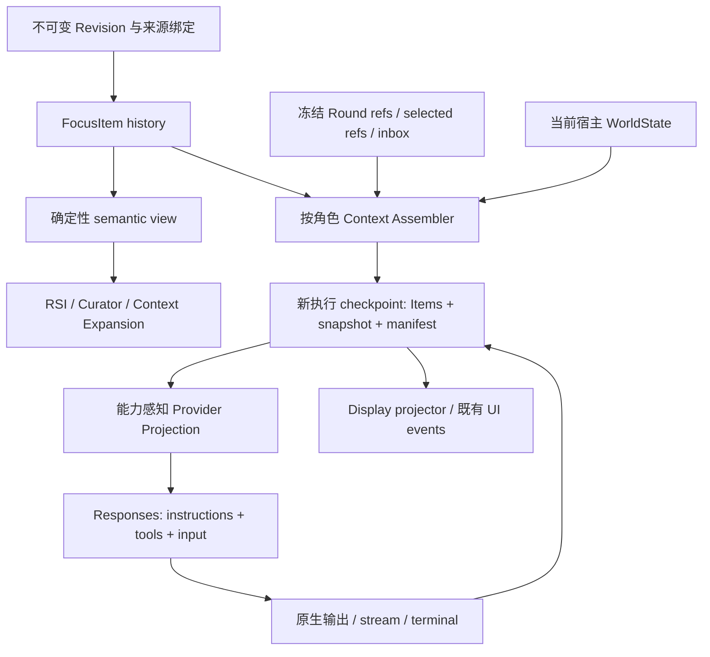

## Context

动机与范围见 [proposal.md](proposal.md)。本设计依据当前工作区及 2026-10-01 的依赖／文档核对；规划完成不代表用户同意 apply。

当前边界：

- `ContextRevisionRef` 已包含 execution thread、namespace 和精确 checkpoint；Revision、来源边与 publication receipt 构成唯一发布权威。
- `reader.py` 对 checkpoint-backed Revision 的 authored／display 会读取运行消息。V2 必须明确新 authored 合同，不能假定当前三种 view 已完全隔离。
- `focus/runtime/runs/events.py` 的消息 codec 面向前端并裁剪扩展字段；`checkpoint_writer.py` 却使用其反序列化写 checkpoint。Responses 原生元数据不能继续经这条有损路径保存。
- RSI 读取完整 execution view，segmenter 以 assistant calls 和 tool results 形成原子单元；fallback、quote 和 ordinal 都受输入选择影响。
- `service.py` 拼接 memory、selected skills、材料 policy 和 mailbox；安全 middleware 在 sampling／tool 边界刷新 SecurityContext。前者需要拆解，后者仍是执行权限来源。
- Main、协作角色、Patrol、Curator、语义投影和承诺评审都调用模型；Loop 的 Observation／Progress／Lineage 已冻结，不能通过新通用 assembler 改成实时读取。

现有兼容来源包括 `incremental-revision-semantic-index`、`restore-cross-segment-semantic-projection`、`separate-loop-progress-and-derivation-lineage`、`separate-tool-output-from-assistant-stream` 等 change 的合同。主 specs 的图像、must-view、材料与显式模型能力要求继续成立；不顺带同步其他 changes。

## Goals / Non-Goals

**Goals:**

- 以无损 typed history 接住 Responses 输出，同时保持 Revision 的不可变性、精确恢复和来源证明。
- 使用同一语义选择规则贯穿 RSI、Curator 和 Context Expansion，使运行控制不会变成任务命题。
- 为长生命周期执行分支建立 checkpoint WorldState，并按角色隔离冻结认知输入与 selected context。
- OpenAI／DeepSeek 使用手工合法 Item replay；所有角色共享协议入口和能力检查。
- 删除替代后的旧拼接与重复转换职责，不在原服务上叠加第二套上下文逻辑。

**Non-Goals:**

- 重写 Kernel、Portfolio 提交、任务进度、Lineage、Run dispatch 或现有租约／outbox。
- 原位迁移旧 Revision、自动归档其他 change、将 Provider compaction 变为 Context Compression authority。
- 全面实现 Codex 每个 wire item、Multi-agent Beta、hosted tools 或 Provider Conversations。
- 为协议迁移重写整个 LangGraph；无损 bridge 可以长期保留，但不能形成第二套可写历史。

## Decisions

图中的执行 checkpoint 推进不直接改写已发布 Revision；只有现有结算和 publication 边界可发布新版本。

### 1. Common envelope carries provenance; payloads retain their own lifecycle

建立封闭的已知 Item 类型与保留原始 JSON 的 unknown 类型。公共 envelope 包含稳定 `item_id`、`kind`、宿主 `origin`、`scope`、payload 和 source refs。语义资格由版本化宿主 selection policy 决定，持久化的资格必须经过宿主校验，不能信任模型提交的字段。

首批支持 Message、Reasoning、FunctionCall／Output、WorldStateUpdate、SelectedContextReference、AgentCollaboration、RoundDecisionContextReference 和 ProjectionRepair。Custom／hosted／compaction 等输出可保存其 Provider 载荷，但只有能力合同明确支持的类型才允许投影和执行。无需先实现庞大的 Codex 枚举才能迁移。

| Scope | Authority | Inheritance |
|---|---|---|
| revision task content／evidence | Revision 和精确来源 | 经派生定义选择 |
| execution exchange／continuation | 执行 checkpoint | 仅兼容连续分支 |
| runtime WorldState | 当前宿主状态 | 新分支重新初始化 |
| selected bindings | Run／Context 的冻结引用 | 显式继承或重新选择 |
| frozen Round decision input | 原有 Round 冻结记录 | 按原认知输入合同消费 |

选择统一 envelope 与分 scope payload，避免 role 和正文反向决定授权，也避免把所有领域状态搬进一个可变 Context 聚合。Round item 保存引用和必要执行投影，原记录仍是权威。

### 2. Canonical history codec is separate from UI and provider codecs

在 Harness 增加独立 history 边界，公开 typed contracts、canonical codec、legacy adapter、语义选择和 display projection。`events.py` 只负责 UI 事件 envelope／展示，不再供权威 checkpoint 反序列化使用。Provider output 解码和合法 input 编码属于模型适配边界。

原生输出保存 Provider 身份、输出 Item 顺序、item ID／call ID、状态和完整必要 payload；保留 message phase 等 Provider 元数据，不把可见正文、reasoning summary 与 encrypted／plaintext continuation 混为一个字段。原始 output 不能未经校验直接当作合法 input；适配器按目标合同去掉只读输出字段并验证关联。

Unknown item 原样保存，但 replay 默认阻止不理解且可能影响后续执行的内容；只有明确的已验证透传／重投影／非必要排除策略可放行，排除必须可审计。修复不能伪造工具已成功执行；必要的协议占位具有 repair 来源、error 语义和 exclude 资格，并沿用既有 projection approval 机制。

替代选择是扩展现有 UI codec 保存更多字段。这仍会让 UI 裁剪与权威格式互相牵制，因此不采用。

### 3. V2 is additive; immutable V1 records remain untouched

Revision 持久化增加可空的版本化 history payload；缺失为 V1，V2 envelope 包含 authored items、execution items、selected binding refs 和必要合同版本。旧 authored／execution message 列只用于 V1；V2 不把这些旧列继续当作另一份可写镜像。既有 NOT NULL 列可在新行保留空兼容值，由版本化 reader 决定读取来源。

V1 adapter 只读转换并给出稳定适配身份，不能从 `<environment_context>` 等标签推断可信来源。确有宿主元数据的字段可以确定性映射；其余保留 legacy-unknown 和既有事实／验证限制，不能升级授权。新发布或派生 Revision 使用 V2 并保存原来源引用。

V2 authored hash 只描述明确定义的任务内容；execution hash 描述保存的执行 Items 和合同；semantic projection 有独立版本化 fingerprint，但不是独立可写 authority。旧 hash 算法和旧索引记录保持不变。

新 execution checkpoint 可以在运行中增长；已发布 Revision 不增长。Run finalizer／publisher 仍按现有事务和 fencing 将精确结算 checkpoint 发布为新 Revision。

### 4. Semantic selection preserves evidence structure and source identity

semantic view 由精确 Revision、binding refs 与 selection policy 确定性生成，不增加独立编辑 API。资格：

- `index`：允许抽取任务命题；来源权威与 claim verdict 仍另行验证。
- `evidence_only`：形成保留 call identity、tool name／arguments／status 的关联证据单元，不独立产生 fallback hypothesis。
- `reference_only`：版本化任务参考或约束，可用于解释和验证，不自动重复制造任务命题。
- `exclude`：reasoning、WorldState、catalog、repair、运行边界等，不进入任务语义覆盖与抽取。

先确定合格任务／证据／引用单元，再做协议关联分段。整个 pipeline 的 segment、fallback、coverage、grounding 和跨段解释显式接收资格，不能继续以“每个未覆盖 execution segment 都补 hypothesis”处理。工具调用虽不单独抽取命题，仍随结果保留解释依据。

semantic view 保留原始 Item identity、来源 checkpoint 和 ordinal 映射；筛选后的列表位置不是原始证据位置。更新 quote resolution、Curator projector、segment record 和 evidence rebinding，防止过滤后引用错位。

索引兼容 fingerprint 纳入 history adapter、selection、binding dependency、segmenter、局部投影与整体 interpretation 版本。当前 `revision-semantic-index-v5` 升级新合同；新版本冷构建，之后仍按已有内容／依赖证明复用局部证据。语义输入变化时整体解释重算；只有 runtime 控制变化时，不凭执行 Item 追加就认定任务内容变化。

Selected 引用按精确版本解析；派生继承规则由来源选择显式保存。绑定消失时返回缺失来源，不偷偷读取当前文件替代。legacy unknown 保持可追溯，不按标签大规模删除可能的用户任务内容。

### 5. WorldState baseline includes retained items, not only prior values

通用 WorldState section 定义稳定 ID、适用角色、snapshot、full renderer 和 diff renderer。首批迁移权限／环境，其后迁移工具／技能目录及运行模式：

| Section | Update strategy |
|---|---|
| permissions、environment、environment_guidance | full replacement |
| agent_mode、collaboration_mode、model_context、workspace_state | full replacement |
| tool_catalog、skills_catalog | added／removed；条目内容变化按 replacement，缺失基线 full |
| plugin_guidance、compression_budget | replacement；只保留确有运行语义的 section |

catalog 文本用于发现，实际 tools schema 每次由当前 Registry 和 SecurityContext 生成。结构化工具能力与文本目录必须一致；不为了迁移立即新增 deferred tools 服务。

checkpoint 保存 snapshot 及证明该状态的 retained item refs／hash 和 renderer、provider projection 版本。差异入口区分 known、unknown、absent；值相同但引用缺失、压缩后状态不完整或合同不兼容时完整重建相关 section。delta 的依赖链必须仍在保留前缀中，否则 full replacement。

在 sampling 之前，通过可持久化 graph state 更新一起保存 Items、snapshot 和本次 request source manifest。网络调用消费这个准备 checkpoint。snapshot 表示该保留输入表达的基线，不等于模型已经理解，也不代表 Provider 已完成；尝试状态另有 prepared／attempted／terminal 区分。恢复 replay 同一准备状态，不能再次追加相同 update。checkpointer 持久化必须给出真实原子边界，不能从 prompt hook 单独写 thread→snapshot 表。

同分支续跑读取精确 checkpoint；rollback 先恢复旧基线再与当前宿主状态比较。派生／merge／compression 重建分支从选定任务内容和证据生成新执行前缀，旧 runtime 更新不默认继承。Snapshot 可以随旧 checkpoint 保留供审计，但不恢复旧授权。

### 6. Request context is composed according to role and lifecycle

在 Desktop 建立薄的 context assembly 适配层，读取现有领域 records 并调用 Harness 的纯组装合同。固定顺序为：请求级 Base Instructions／role behavior；input 中宿主政策与 WorldState；任务选定 reference；角色允许的冻结认知输入／collaboration；合法保留任务历史和当前真实输入。后续变更追加到当前执行位置，不重新排序既有消息。政策独立消息边界由 section authority 与 Provider 合同保留。

Base Instructions 每次请求显式提供并记录版本；模型／角色基础行为变化触发相关 projection 合同更新，不从历史猜测有效基础 prompt。

selected skill 的冻结正文或版本化引用与 skills catalog 分开；memory 默认 reference_only，用户确认产生的新 TaskContract 可 index。Material 用户正文／备注仍是任务输入，平台读取 policy 单独 exclude。镜像后的外部内容不能通过自述变成 policy。

长生命周期 Main／Teammate 使用可恢复动态 WorldState。一次性认知 Worker 只接收最小、显式、版本化输入，不自动带入 Main workspace／mailbox／opaque history。Patrol／Curator 在本 Round 使用原冻结 Observation、Progress、Lineage；Assembler 接收这些 refs，不重新查询实时替代。

must-view 是实际请求约束：保留 history/display 中的旧图片引用不意味着向新 Run 回传旧像素。实际 replay 经过本轮 image binding 投影，未选图像不送入，必需图像按精确绑定补齐；主 specs 的 read 声明校验照常。任何改变既有 Provider 输入前缀的材料投影也必须重新检查 continuation 合法性。

请求 manifest 记录 source checkpoint、角色、基础行为／工具合同 hash、selected refs、冻结 Round refs、WorldState 及 projection 版本；不另存可任意修改的业务上下文。敏感原生载荷不能被普通日志或 UI 调试输出展开。

### 7. Collaboration acknowledgment follows durable input delivery

将 `load_unread_messages()` 的“读取即 read_at”拆为获取和确认。AgentCollaborationItem 保存消息身份、author／recipient、原始来源和宿主分配的语义资格；先写入执行 checkpoint，再以稳定 delivery key 确认已投递。checkpoint 已保存而 ack 未保存时，恢复读取 delivery refs 后补 ack，不重复 append。

复用现有数据库事务／唯一约束／fencing；不新建消息调度器。已投递只表示输入持久化，不表示模型读懂或任务结果已被采纳。历史 read_at 缺少投递证明时保持旧兼容状态，不臆造过去已知的 checkpoint。

### 8. Responses adapters implement explicit, tested capabilities

在现有 `focus/models` 内建立协议投影边界，工厂读取显式 provider／protocol／capability 合同。使用 BaseChatModel-compatible Responses 适配入口继续支持 create_agent、bind_tools 和 structured output；可复用 ChatOpenAI 的已验证能力，Provider 差异由窄适配器处理，不把两个不同协议强塞进旧 DeepSeek Chat shim。

| Contract | OpenAI Responses | DeepSeek Responses |
|---|---|---|
| Context | manual replay，store=false，不用 previous ID／conversation | manual replay，省略不支持的持久会话参数 |
| Policy projection | 请求 instructions＋developer policy | 请求 instructions＋合法 system policy |
| Tools | Focus function tools | Focus function tools；不依赖 hosted tool |
| Reasoning | 保存原生 reasoning／encrypted continuity；summary 是 display | 保存其 plaintext reasoning；按 Provider 规则回放 |
| Structured output | text.format＋本地领域校验 | text.format＋能力检查及本地领域校验 |
| Modalities | 显式模型声明与投影校验 | 显式模型声明与其 role／格式限制校验 |

DeepSeek developer 当 user、hosted tools 忽略、custom tools 限制及并行调用行为需要本地预校验。能力按经测试的模型合同声明，不硬编码所有模型支持同一组参数。配置未知 provider／protocol 时拒绝；旧 `use` 配置只在固定映射内进入显式 legacy-chat 兼容合同。Responses 配置失败不能静默降级。

Structured output 的参数、schema strictness、拒绝与 incomplete 由适配器归一化，原有领域结果验证继续运行。所有模型角色的工厂调用点必须纳入清单；不能只修改 Main 的 endpoint。

不预先实现全部 custom／hosted／configuration_update 路径。Codex 的枚举不等于所有模型通用能力清单；本 change 先保证当前 Focus function 工具及结构化认知调用。

### 9. A retained bridge is acceptable only when it is lossless and single-authority

自定义执行 state 以 typed execution items 为权威；`messages` 是供现有模型／工具图消费的可验证兼容投影。模型输出、工具输出与宿主输入通过同一 bridge 更新权威 Items 与相应消息视图，不能只改其中一条通道。每个消息可关联原始 output item identities／output group，但 opaque 载荷不依赖 UI 字段保存。

协议校验分为任务定义适用性、typed exchange 关联、Provider 合法 input 三个边界。`context_protocol.py` 保留现有审批／repair 决策流程，底层闭合规则移到 typed 协议；禁止用 H→A→T 邻接规则处理所有未知 Item。工具结果关联凭 call ID，不凭字符串或最近一条 AIMessage。

桥接回放前验证消息／Item 对应和投影合同；不兼容时明确重建或拒绝。Reducer 更新必须保留并行工具结果并去重；不能将两个完成结果互相覆盖。若库原生消息格式不足以表达 Provider continuation，适配器从权威 Items 构造 input，不能绕回有损消息序列。

替代选择是立刻原生 Item 化整个图，影响过大；另一个选择是永久将原生输出压进 AIMessage 正文字段，会丢失边界。因此保持现有调度，重构协议权威；以后是否重写图由实际需要决定。

### 10. Native streaming and terminal status precede run success

Provider decoder 保存 output index、item ID、call ID 和必要 content 索引；Stream Normalizer 输出可见 text、可见 reasoning、tool argument 活动、原生完成 Item、usage 和明确 terminal。

OpenAI summary delta 与 DeepSeek reasoning_text delta 分开适配。不能从“dict 中存在 text”猜测内容通道；partial item、工具参数、工具输出和控制事件不进入 tokens。最终持久化的 reasoning 可以多于流式 display，不依赖 display 还原原生 Items。

工具执行默认只消费正常 completed attempt 中已完成且验证有效的调用；incomplete／failed 的部分输出不直接执行工具。对 incomplete、拒绝、断流默认可诊断终止或使用现有明确有界策略，不能用自动无限重试掩盖状态。Provider completed 仅表示该模型尝试完成，Run 是否完成仍由 Agent graph、must-view、CompletionGuard 和现有 finalizer 裁决。

部分内容作为 audit 不作为完整 replay authority。工具已产生副作用但完成记录未知时遵守现有 uncertain-run 中断策略，不宣称外部 exactly-once。取消、deadline 和旧 fence 的迟到响应不能覆盖终态。

usage 以 attempt identity 去重；保留 Provider 可用的 reasoning／cache 指标，缺失为 unknown。窗口估算使用实际组装并投影后的 instructions、tools、schema、input 与图像口径，压缩 gate 复用同一计量输入，不能只估 semantic view。

### 11. Provider continuation is not semantic compression authority

同 Provider、兼容投影和合法连续前缀内保留原生 continuation。派生／merge／历史手术／Provider 切换默认重建任务与证据输入，排除旧 opaque continuation；若未来允许特殊前缀继承，必须另有内容与 Provider 合同证明，本 change 不默认启用。

Provider compaction 原样保存执行载荷，但首版不自动请求 compaction、不因此发布 Revision。Focus Compression 继续产生明确版本、来源和恢复记录；压缩后 WorldState 检查 retained baseline 并补回，图片与引用仍遵守各自合同。

### 12. Module boundaries replace responsibilities rather than accumulate layers

以下为职责落点，最终文件细分依单一职责决定，不要求每个名字都变成一个类：

| Boundary | Responsibility | Forbidden dependency |
|---|---|---|
| Harness `focus/history` | Item contracts、codec、legacy／semantic／display projections、typed protocol | Desktop ORM、UI reducer、Provider HTTP |
| Harness runtime context | section snapshots、pure diff／assembly contracts、checkpoint state bridge | Context publication、实时 Round 查询 |
| Harness `focus/models` | capabilities、合法请求投影、原生输出／SSE 解码、模型接口 | Revision 写入、权限批准 |
| Desktop `context_evolution` | V1／V2 repo／reader、hash、来源、shadow checkpoint／publication adapters | Provider 状态作为 current pointer |
| Desktop context assembly | 解析 selected／role／Round／inbox refs，提供宿主状态 | 执行权限裁决、独立 Lineage 写入 |
| RSI／Curator consumers | semantic view、引用映射、版本化缓存与验证 | 原始 execution 的无差别抽取 |
| Security | 当前能力与具体调用授权裁决 | 依赖 prompt 或 WorldState 放行 |
| Runtime events／desktop renderer | display、snapshot 交接和有界呈现 | 权威历史 codec |

`service.py` 只组合端口。成功替换后删除旧 memory／skill／material／mailbox prompt 拼接；`FileModeContextMiddleware` 的描述职责迁到 WorldState，工具侧实际安全刷新继续保留。旧 DeepSeekChatOpenAI 仅保留已声明 legacy 路径，不能叠加 Responses 分支形成混合巨型类。

核心方法表达单一业务操作，辅助方法采用受保护命名；确有独立用途的纯转换可为模块函数、staticmethod 或 classmethod。共享 helpers 不能成为无边界的工具箱。修改／新建代码文件时核对头部声明式说明：对外接口、输入及含义、输出及含义、流程和示例；其他位置非必要不写注释。

### 13. Implementation requires explicit approval and a fresh Context7 preflight

本轮只写 artifacts。tasks 的所有实现项保持未完成；OpenSpec 显示规划完成不代表获得 apply 授权。收到用户明确同意本 change 后，改代码前重新发现并实际调用 Context7，按将要使用的库核对文档；找不到或不可用时立即停止并询问用户，不用本轮研究或模型记忆代替。

Context7 文档与 Provider 官方文档共同作为理论依据；依赖版本还需契约测试。本轮记录不是“已验证真实 API”。所有关键语义合同用无密钥 fixture 和持久化／恢复测试验证，真实 Provider smoke 的结果另行记录。

## Risks / Trade-offs

- [Library bridge 丢失原生字段或 Provider 新事件] → 独立 codec、原生 fixtures、typed roundtrip、明确版本范围；不以开启 use_responses_api 当作迁移验收。
- [V1 来源不完整] → 宿主可证明则适配，其余 legacy-unknown；保持旧内容与 hash，不根据正文猜测权限。
- [手工 replay 输入规模增加] → 基于完整实际请求计量和现有压缩治理；append once 是逻辑历史语义，不承诺只传增量或减少网络 tokens。
- [WorldState 与 checkpoint 写入不一致] → 同一 state 提交、retained refs 校验与故障注入；不引入可变 thread snapshot 的第二权威。
- [semantic 筛选使证据错位或约束消失] → 原始身份映射、关联证据单元、精确 selected bindings 和端到端 quote 验证。
- [新旧 writer 混用覆盖历史] → V2 启用前隔离旧 writer；未知 schema fail closed；旧二进制不能恢复 V2 活动执行。
- [mailbox ack 跨存储边界] → checkpoint delivery refs 先持久化、唯一 delivery key 后确认，恢复核对并补 ack。
- [首版同时覆盖多角色成本较高] → 分阶段 gate，但不能宣布迁移完成时仍存在未声明的旧调用路径。

## Migration Plan

1. **Gate 0：批准与研究。** 用户同意后刷新 Context7 和相关官方合同，记录依赖与模型调用清单，冻结兼容测试 fixture；本轮不执行。
2. **Gate 1：历史与语义。** 保持 Chat API，加入 V2、无损 codec／bridge／typed calls、semantic view 和新索引 fingerprint。旧 Revision 内容 hash 不变；证据关联、引用和跨段解释通过回归才继续。
3. **Gate 2：上下文与恢复。** 迁权限／环境，然后 catalogs、selected context 和 mailbox；验证同分支、压缩、rollback、derive／merge、准备前后崩溃和权限 TOCTOU。状态 Items 与 snapshot 的原子性失败则不能推进。
4. **Gate 3：Responses。** 接入双 Provider 的请求／输出／stream 合同；显式启用 Responses，覆盖所有角色与 structured output。完成 fixture、恢复和受控真实 smoke 后迁移默认协议及可识别配置；legacy 仅显式可用，不自动 fallback。
5. **Gate 4：清理与验收。** 删除已替代重复职责，补 docs／头部说明，跑必要 backend、desktop、security、materials、compression、RSI／Loop 回归；记录每个规范场景和实际测试证据。

部署采用扩展式 schema。阶段开关控制新 Run admission，不让同一活动分支交替被旧／新 writer 写入。回退可停止 V2 admission 并保留支持 V2 的 reader 进行历史读取；V2 活动 Run 应由兼容版本结算或按既有规则中断。若需要切回 legacy-chat，新建明确的执行分支并重建输入，不把 Responses opaque continuation 塞入 Chat 历史。已有 V1 不需要回写，新索引和 V2 数据不删除，schema downgrade 不用于运行中的回退。

## Validation Contracts

验收覆盖六份 specs 的每个 Requirement／Scenario，并至少包含：

1. 原生 reasoning＋并行 calls＋outputs 经 encode／decode／checkpoint／replay 无损，display 不影响原始载荷。
2. V1 读取／派生、V2 新发布、未知 schema 拒绝；旧 hash 与缓存记录不变。
3. 仅运行控制变化不生成 RSI 命题；工具参数与结果仍可查证；过滤后 quote 正确；selected 约束可解析。
4. retained 基线被压缩删除、renderer 改变、rollback／新 workspace 派生都能重建当前状态。
5. sampling 后收窄权限、一次调用批准及 child capabilities 不产生权限提升。
6. mailbox checkpoint 前／后故障都不丢失、不重复投递；不能把输入投递称为理解或结果采纳。
7. OpenAI／DeepSeek 实际 payload、role、schema、工具能力、图片与 manual replay 符合各自合同。
8. completed／incomplete／failed／断流／拒绝／取消、重复事件、部分参数和旧 fence 被正确收束。
9. 各认知角色保持冻结输入与领域质量校验；Provider output 不绕过 Kernel、publisher、CompletionGuard。
10. tokens／reasoning／工具行和最终 snapshot 去重，长正文成本边界与承诺子图隔离不回归。

资料与版本核对见 [research.md](research.md)。
